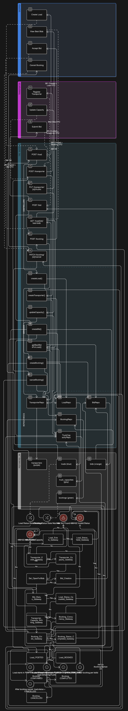
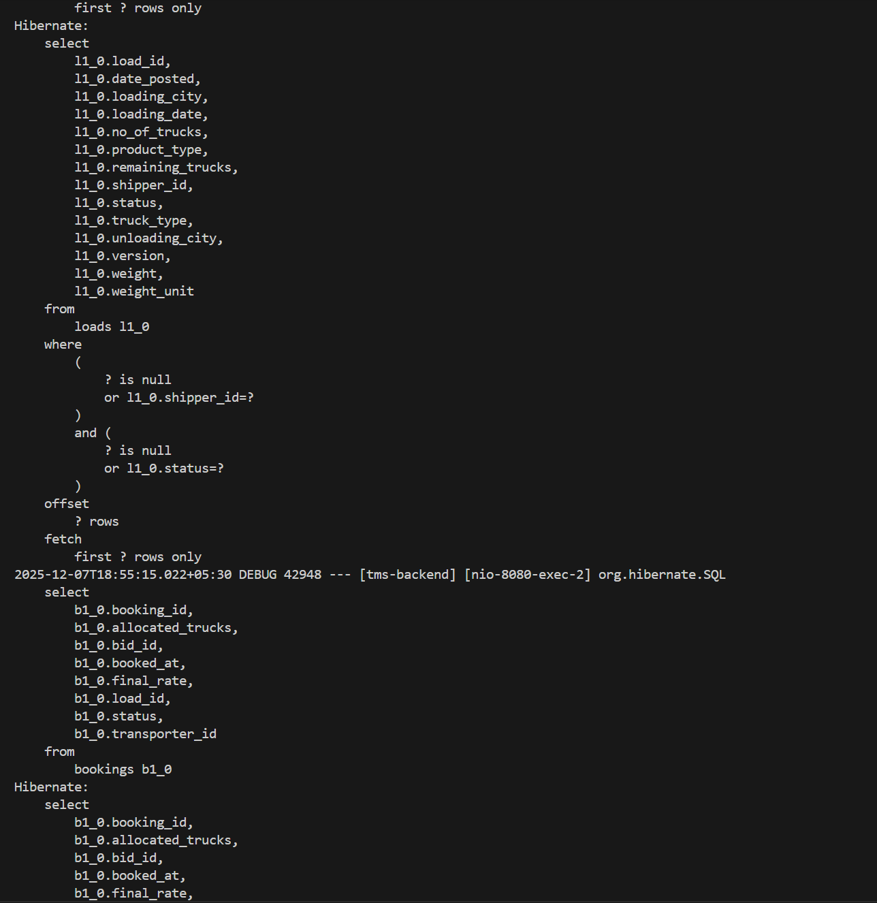

# Transport Management System (TMS) – Backend

A Spring Boot–based backend for a Transport Management System that models real-world logistics workflows: loads posted by shippers, bidding by transporters, and booking management with proper capacity handling, status transitions, and optimistic locking.

---

## Table of Contents

- [Overview](#overview)
- [Architecture & Flow](#architecture--flow)
- [Domain Model & Database Schema](#domain-model--database-schema)
- [Business Rules](#business-rules)
- [API Documentation](#api-documentation)
- [Running the Application Locally](#running-the-application-locally)
- [Testing & Coverage](#testing--coverage)
- [Project Structure](#project-structure)
- [Design Decisions & Notes](#design-decisions--notes)

---

## Overview
## 🎥 Demo
<p align="center">
  
</p>

This backend implements the core logistics workflows for a Transport Management System:

- Shippers create **loads**
- **Transporters** register their fleet and capacity
- Transporters **bid** on eligible loads
- Shippers/logic **accept bids**, creating **bookings**
- Proper **capacity validation**, **multi-truck allocation**, and **status transitions**
- **Optimistic locking** to prevent concurrent double booking
- Clean layered architecture with DTOs, services, repositories, and global exception handling

---

## Architecture & Flow

High-level flow of the system from load creation to booking completion:

> Place the diagram at: `assets/flowchart.png`



This diagram also reflects the core database schema and relationships between `Load`, `Transporter`, `Bid`, and `Booking`.

---

## Domain Model & Database Schema

### Core Entities

**1. Load**

```json
{
  "loadId": "UUID",
  "shipperId": "String",
  "loadingCity": "String",
  "unloadingCity": "String",
  "loadingDate": "Timestamp",
  "productType": "String",
  "weight": "double",
  "weightUnit": "KG | TON",
  "truckType": "String",
  "noOfTrucks": "int",
  "status": "POSTED | OPEN_FOR_BIDS | BOOKED | CANCELLED",
  "datePosted": "Timestamp",
  "remainingTrucks": "int"
}
```

**2. Transporter**

```json
{
  "transporterId": "UUID",
  "companyName": "String",
  "rating": "double (1-5)",
  "availableTrucks": [
    {
      "truckType": "String",
      "count": "int"
    }
  ]
}
```

**3. Bid**

```json
{
  "bidId": "UUID",
  "loadId": "UUID",
  "transporterId": "UUID",
  "proposedRate": "double",
  "trucksOffered": "int",
  "status": "PENDING | ACCEPTED | REJECTED",
  "submittedAt": "Timestamp"
}
```

**4. Booking**

```json
{
  "bookingId": "UUID",
  "loadId": "UUID",
  "bidId": "UUID",
  "transporterId": "UUID",
  "allocatedTrucks": "int",
  "finalRate": "double",
  "status": "CONFIRMED | COMPLETED | CANCELLED",
  "bookedAt": "Timestamp"
}
```

### Database Schema Diagram (Required)

> **Location:** `assets/flowchart.png`
> The schema diagram in this repo shows:
>
> * `Load` ↔ `Bid` (1-to-many)
> * `Load` ↔ `Booking` (1-to-many)
> * `Transporter` ↔ `Bid` (1-to-many)
> * `Transporter` ↔ `Booking` (1-to-many)
> * `Transporter` ↔ `TruckCapacity` (1-to-many)
>
> It also highlights:
>
> * `@Version` field on `Load` for optimistic locking
> * Unique constraint: **one ACCEPTED bid per load** (via unique constraint on `booking.bid_id`)
> * Indexes on: `load_id`, `transporter_id`, `status`

---

## Business Rules

### Rule 1: Capacity Validation 

* A transporter can **only bid** if:
  * `trucksOffered ≤ availableTrucks` for the requested `truckType`
* When a booking is **confirmed**:
  * `allocatedTrucks` are **deducted** from the transporter's `availableTrucks`
* When a booking is **cancelled**:
  * `allocatedTrucks` are **restored** back to the transporter's `availableTrucks`

### Rule 2: Load Status Transitions 

* `POSTED → OPEN_FOR_BIDS` when the **first bid** is received
* `OPEN_FOR_BIDS → BOOKED` when the load is **fully allocated**
* `BOOKED → CANCELLED` when the **booking is cancelled** (and business rules allow)

Additional guards:

* ❌ Cannot bid on `CANCELLED` or `BOOKED` loads
* ❌ Cannot cancel a load that is already `BOOKED` (enforced via service logic and custom exceptions)

### Rule 3: Multi-Truck Allocation 

* If `noOfTrucks > 1`, multiple bookings are allowed for the same load.
* The system tracks:
  ```text
  remainingTrucks = noOfTrucks - SUM(allocatedTrucks for all bookings)
  ```
* Load is considered **BOOKED** when:
  ```text
  remainingTrucks == 0
  ```

### Rule 4: Concurrent Booking Prevention (Optimistic Locking) 

* `Load` entity has a `@Version` field.
* When two transactions try to allocate trucks simultaneously:
  * The **first** succeeds.
  * The **second** hits an `OptimisticLockException` → wrapped as `LoadAlreadyBookedException` / HTTP 409 (Conflict).

### Rule 5: Best Bid Calculation 

* For a given load, **best bids** are computed via:
  ```text
  score = (1 / proposedRate) * 0.7 + (rating / 5) * 0.3
  ```
* `GET /load/{loadId}/best-bids` returns bids sorted by **descending score**.

---

## API Documentation

### Swagger / OpenAPI

> **Swagger UI URL (local):**
>
> ```text
> http://localhost:8080/swagger-ui/index.html
> ```
>
> **OpenAPI JSON:**
>
> ```text
> http://localhost:8080/v3/api-docs
> ```

> Include this link in the README after enabling Swagger (e.g., with `springdoc-openapi-starter-webmvc-ui`).

### Postman Collection (Alternative)

If you prefer Postman:

> **Postman collection file in repo:**
>
> ```text
> postman/TMS-Backend.postman_collection.json
> ```

This collection covers:

* Load APIs
* Transporter APIs
* Bid APIs
* Booking APIs
* Sample happy-path and edge-case flows

### API Overview

#### Load APIs (5)

| Method | Endpoint                               | Description                                |
| ------ | -------------------------------------- | ------------------------------------------ |
| POST   | `/load`                                | Create a new load (status = `POSTED`)      |
| GET    | `/load?shipperId=&status=&page=&size=` | List loads with filters & pagination       |
| GET    | `/load/{loadId}`                       | Get load details with active bids          |
| PATCH  | `/load/{loadId}/cancel`                | Cancel a load (with status validation)     |
| GET    | `/load/{loadId}/best-bids`             | Get best bid suggestions (sorted by score) |

#### Transporter APIs (3)

| Method | Endpoint                              | Description                             |
| ------ | ------------------------------------- | --------------------------------------- |
| POST   | `/transporter`                        | Register a transporter and its capacity |
| GET    | `/transporter/{transporterId}`        | Get transporter details                 |
| PUT    | `/transporter/{transporterId}/trucks` | Update available trucks for each type   |

#### Bid APIs (4)

| Method | Endpoint                              | Description                                      |
| ------ | ------------------------------------- | ------------------------------------------------ |
| POST   | `/bid`                                | Submit a bid (capacity & load status validation) |
| GET    | `/bid?loadId=&transporterId=&status=` | Filter bids                                      |
| GET    | `/bid/{bidId}`                        | Get bid details                                  |
| PATCH  | `/bid/{bidId}/reject`                 | Reject a bid                                     |

#### Booking APIs (3)

| Method | Endpoint                      | Description                                                      |
| ------ | ----------------------------- | ---------------------------------------------------------------- |
| POST   | `/booking`                    | Accept bid & create booking (deduct trucks, handle concurrency)  |
| GET    | `/booking/{bookingId}`        | Get booking details                                              |
| PATCH  | `/booking/{bookingId}/cancel` | Cancel booking (restore trucks & update load status if required) |

---

## Running the Application Locally

### Prerequisites

* **Java**: 17+
* **Maven**: 3.9+
* **PostgreSQL**: 13/18+ (configured as below)

### Database Setup

1. Ensure PostgreSQL is running on **port 5433** (as configured):

   ```yaml
   spring:
     datasource:
       url: jdbc:postgresql://localhost:5433/tms_db
       username: postgres
       password: 12345
   ```

2. Create the database:

   ```bash
   psql -U postgres -h localhost -p 5433
   CREATE DATABASE tms_db;
   \q
   ```

3. Tables are auto-created by Hibernate (`ddl-auto: update`).

### Application Configuration

Main config file:

```text
src/main/resources/application.yml
```

Key properties:

```yaml
spring:
  application:
    name: tms-backend

  datasource:
    url: jdbc:postgresql://localhost:5433/tms_db
    username: postgres
    password: 12345
    driver-class-name: org.postgresql.Driver

  jpa:
    hibernate:
      ddl-auto: update
    show-sql: true
    properties:
      hibernate:
        format_sql: true

server:
  port: 8080

logging:
  level:
    com.tms: DEBUG
    org.hibernate.SQL: DEBUG
```

### Run the Backend

From the `backend` directory:

```bash
mvn spring-boot:run
```

The service will start at:

```text
http://localhost:8080
```

> Note: Requesting `/` (root) directly may return a generic JSON error if no static index is configured. Use the API endpoints or Swagger UI.

---

## Testing & Coverage

### Running Tests

```bash
mvn test
```

### Coverage

Test coverage is generated (e.g., using JaCoCo) and visualized in the IDE / generated reports.

> **Test Coverage Screenshot (Required by assignment)**
> Included at:

```text
assets/screenshots.png
```

This image shows:

* Overall test coverage summary
* Line/branch coverage for service and business logic layers

---

## Demo & Screenshots

> Place the following assets under the `assets/` directory:

* **Demo GIF** – `assets/demo.gif`
  Short demonstration of a full flow (create load → bid → best bids → accept → booking).

* **Screenshots** – `assets/screenshots.png`
  Contains:
  * Example Postman/Swagger calls
  * Test coverage panel

* **Flowchart / Schema Diagram** – `assets/flowchart.png`

Example embedding:

```markdown


```

---

## Project Structure

```text
backend/
├── src/
│   ├── main/java/com/tms/
│   │   ├── controller/      # REST controllers (Load, Transporter, Bid, Booking)
│   │   ├── service/         # Business logic and rule enforcement
│   │   ├── repository/      # Spring Data JPA repositories
│   │   ├── entity/          # JPA entities (Load, Transporter, Bid, Booking, TruckCapacity)
│   │   ├── dto/             # Request/response DTOs
│   │   └── exception/       # Custom exceptions + global handler (@ControllerAdvice)
│   └── test/                # Unit tests / integration tests
├── assets/
│   ├── flowchart.png        # Database schema / system flow diagram
│   ├── screenshots.png      # UI + test coverage
│   └── demo.gif             # Demo of flow
├── postman/
│   └── TMS-Backend.postman_collection.json
├── pom.xml
└── README.md
```

---

## Design Decisions & Notes

* **Separation of Concerns**: Controller → DTO → Service → Repository → Entity.
* **Business Safety**:
  * Strict **status checks** before state transitions.
  * **Capacity validation** centralised in service layer.
  * **Optimistic locking** on `Load` avoids double bookings under concurrency.
* **Database Design**:
  * Foreign keys with proper constraints and cascade behaviour.
  * Unique constraint to ensure **only one accepted bid per load**.
  * Indexes on `load_id`, `transporter_id`, and `status` for bid/booking queries.
* **Error Handling**:
  * Centralized via `@ControllerAdvice`.
  * Custom exceptions such as:
    * `InvalidStatusTransitionException`
    * `InsufficientCapacityException`
    * `LoadAlreadyBookedException` (wrapping optimistic lock)
    * `ResourceNotFoundException`

